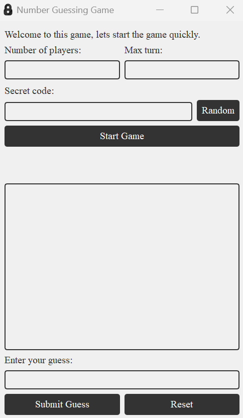
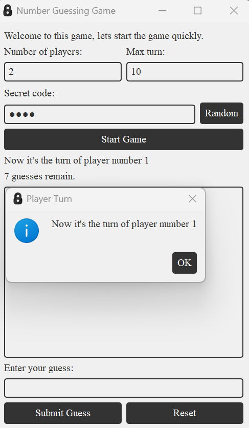

# PyQt5 Number Guessing Game

## Overview

This is a simple number guessing game developed using Python and PyQt5. The game allows multiple players to guess a secret 4-digit code, and provides feedback on how many digits are correct and in the correct position. The game continues until one of the players correctly guesses the code or all players exhaust their turns.

## Features

- Multi-player support
- User-friendly graphical interface
- Feedback on guesses with hints
- Game history display
- Customizable game window with a logo

## Screenshots





## Running the Game

To start the game, run the following command:
```sh
python main.py
```

## How to Play

1. **Enter the number of players** and a secret 4-digit code (e.g., `1234`).
2. **Players take turns** to guess the secret code.
3. **Feedback** is provided after each guess indicating how many digits are correct and in the correct position.
4. The game continues until a player correctly guesses the secret code or all players exhaust their turns.

## Customization

- **Change the Logo**: Replace the `logo.png` file with your own image to customize the application window icon.
- **Change Styles**: Modify the CSS-like styles in the `initUI` method of the `Game` class to customize the appearance of the game.
