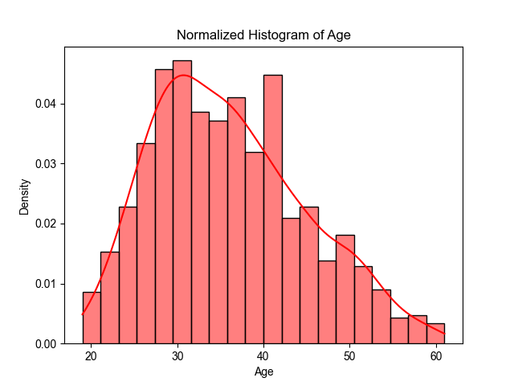
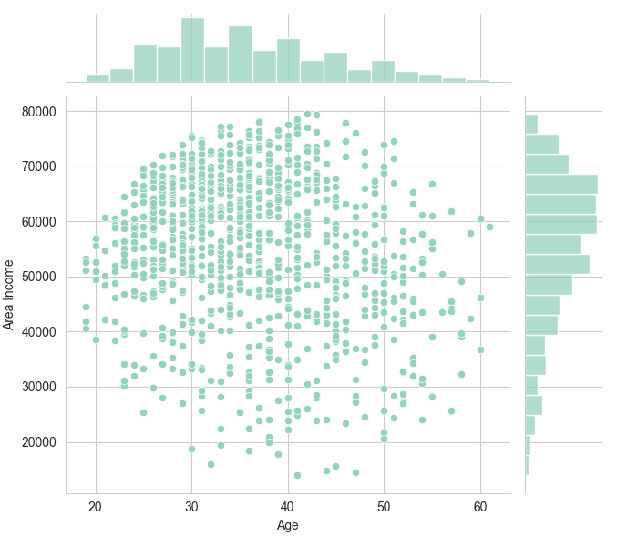
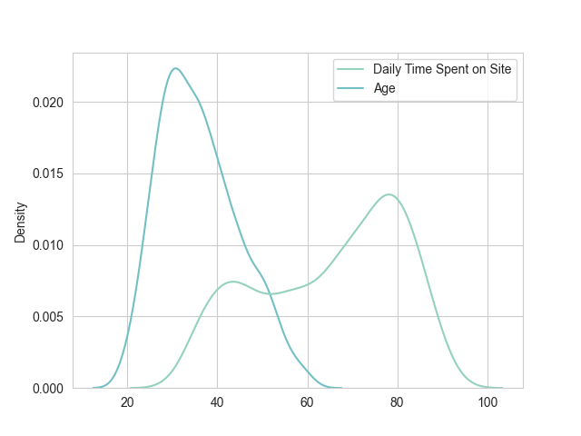
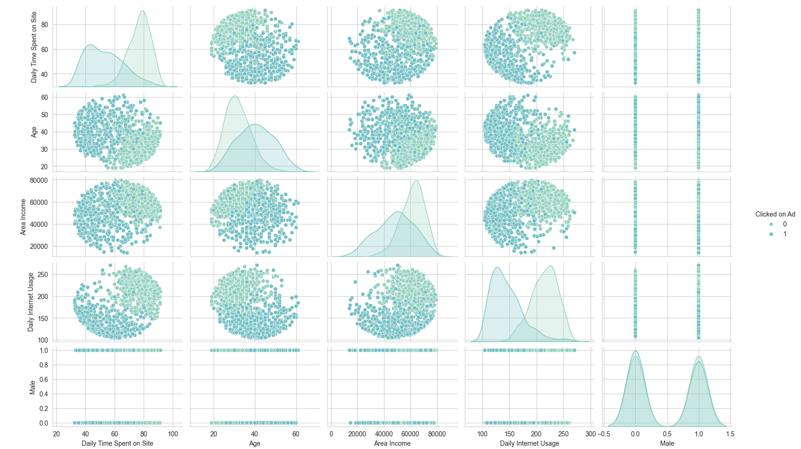
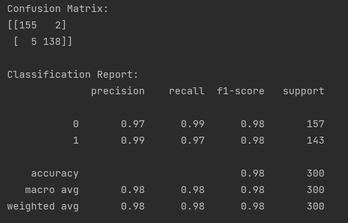
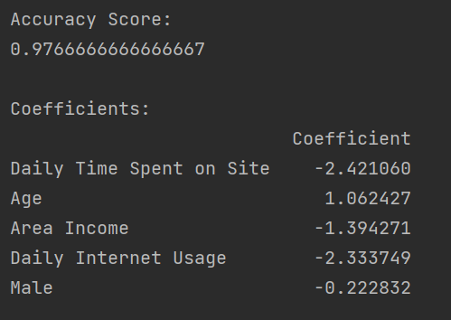

Here's the updated `README.md` with related code included alongside the explanations:

---

# Advertising Company Dataset Analysis

The goal of this task is to analyze a dataset from an advertising company and predict whether a user will click on an advertisement.

## Steps for Analysis

### 1. Load the Dataset
Read the dataset into a DataFrame and display general and statistical information about it.

```python
import pandas as pd  # Importing pandas for data manipulation

# Reading the dataset from the CSV file
df = pd.read_csv('Q8_advertising.csv')

# Display general and statistical information about the dataset
print(df.info())
print(df.describe())
```

### 2. Age Distribution Plot
Plot the statistical distribution of age.



```python
import seaborn as sns  # Importing seaborn for data visualization
import matplotlib.pyplot as plt  # Importing matplotlib for plotting

# Plotting a normalized histogram of the 'Age' column
plt.figure()
sns.histplot(df['Age'], kde=True, stat='density', bins=20, color='red')
plt.title('Normalized Histogram of Age')
plt.savefig('screenshots/8_2.png')
plt.show()
```

### 3. Joint Plot of Income vs Age
Create a joint plot of income versus age.



```python
# Setting the palette and style for seaborn plots
sns.set_palette("GnBu_d")
sns.set_style("whitegrid")

# Creating a joint plot for 'Age' vs 'Area Income'
sns.jointplot(data=df, x='Age', y='Area Income')
plt.savefig('screenshots/8_3.png')
plt.show()
```

### 4. KDE Plot of Time Spent on Site vs Age
Draw a KDE plot of the amount of time spent on the advertisement site versus age.



```python
# Creating a temporary DataFrame for 'Daily Time Spent on Site' and 'Age'
df_temp = df[['Daily Time Spent on Site', 'Age']]

# Plotting a KDE plot for 'Daily Time Spent on Site' vs 'Age' using the temporary DataFrame
plt.figure()
sns.kdeplot(data=df_temp)
plt.title('KDE Plot of Daily Time Spent on Site vs Age')
plt.savefig('screenshots/8_4.png')
plt.show()
```

### 5. Pair Plot
Create an overall pair plot for the dataset, highlighting the difference between those who clicked on the advertisement and those who did not (use `hue='Clicked on Ad'`).



```python
# Creating a pair plot for the dataset with hue set to 'Clicked on Ad'
sns.pairplot(df, hue='Clicked on Ad')
plt.savefig('screenshots/8_5.png')
plt.show()
```

### 6. Analyze Plots
Based on all the plots created, what conclusions can you draw?

### 7. Preprocessing
Perform the necessary preprocessing steps with explanations, split the data into features and labels, and finally, divide it into training and testing sets.

```python
# Dropping unnecessary columns and separating features and labels
df_x = df.drop(columns=['Ad Topic Line', 'City', 'Country', 'Timestamp', 'Clicked on Ad'])
df_y = df[['Clicked on Ad']]

# Saving features and labels to CSV files
df_x.to_csv("train.csv")
df_y.to_csv("lable.csv")

# Reshaping the labels to a 1-dimensional array
df_y = df_y.values.reshape(-1, )

# Scaling the features using StandardScaler
from sklearn.preprocessing import StandardScaler  # Importing StandardScaler for feature scaling

scaler = StandardScaler()
X_norm = scaler.fit_transform(df_x)

# Splitting the dataset into training and testing sets
from sklearn.model_selection import train_test_split  # Importing train_test_split for splitting the dataset

X_train, X_test, y_train, y_test = train_test_split(X_norm, df_y, test_size=0.3, random_state=101)
```

### 8. Logistic Regression Model
Build a logistic regression model without using ready-made libraries, and train it on the data.

```python
from sklearn.linear_model import LogisticRegression  # Importing LogisticRegression for building the model

# Creating and training the logistic regression model
model = LogisticRegression()
model.fit(X_train, y_train)
```

### 9. Predict Test Data
Using the trained model, predict which users will click on the advertisements for the test data.

```python
# Making predictions on the test set
y_pred = model.predict(X_test)
```

### 10. Evaluation Metrics
Report the evaluation metrics such as the Score, Confusion Matrix, and Classification Report for the trained model.




```python
from sklearn.metrics import classification_report, confusion_matrix, accuracy_score  # Importing metrics for evaluation

# Printing the confusion matrix
print("Confusion Matrix:")
print(confusion_matrix(y_test, y_pred))

# Saving the confusion matrix plot
plt.figure()
sns.heatmap(confusion_matrix(y_test, y_pred), annot=True, fmt='d')
plt.title('Confusion Matrix')
plt.savefig('screenshots/10_8_1.png')
plt.show()

# Printing the classification report
print("\nClassification Report:")
print(classification_report(y_test, y_pred))

# Saving the classification report plot (example as text)
plt.figure()
plt.text(0.01, 1.25, str(classification_report(y_test, y_pred)), {'fontsize': 10}, fontproperties='monospace') 
plt.axis('off')
plt.savefig('screenshots/10_8_2.png')
plt.show()

# Printing the accuracy score
print("\nAccuracy Score:")
print(accuracy_score(y_test, y_pred))

# Creating a DataFrame for the coefficients of the features and printing it
coefficients = pd.DataFrame(model.coef_[0], df_x.columns, columns=['Coefficient'])
print("\nCoefficients:")
print(coefficients)
```

---