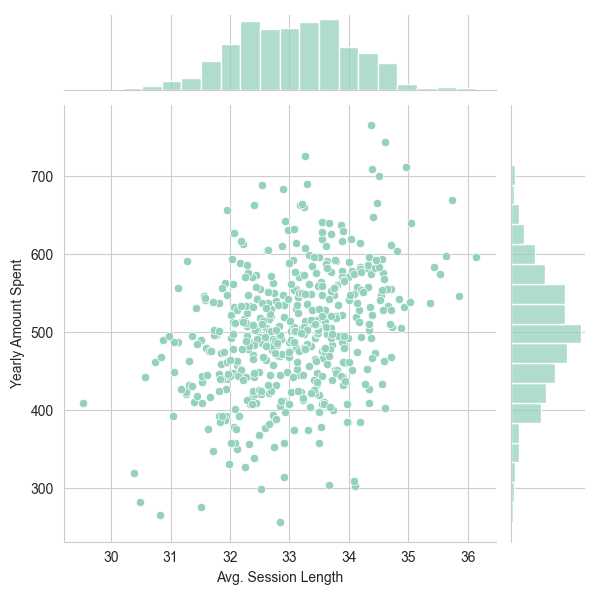
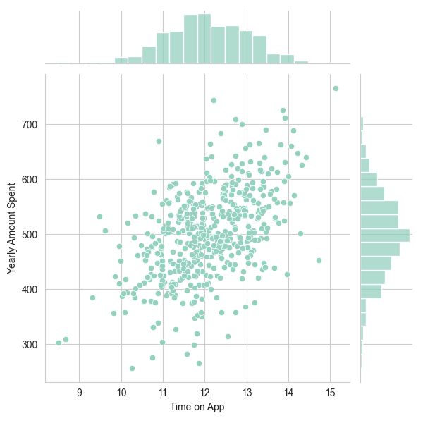
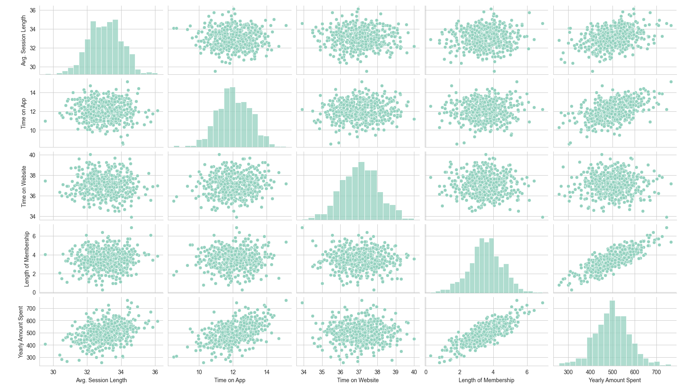
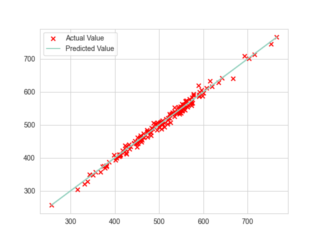
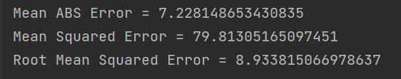
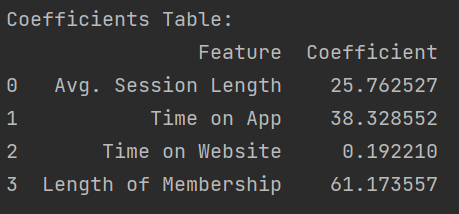

# Online Clothing Store Analysis

This project involves analyzing and predicting customer behavior for an online clothing store. The company conducts in-person consultation sessions with customers, after which customers place orders through the application or website. A dataset named `Ecommerce Customers` has been provided, which includes the following features:

- **Email**: Customer's email
- **Address**: Customer's address
- **Avatar**: Profile color
- **Avg. Session Length**: Average length of consultation sessions
- **Time on App**: Average time spent on the app after the session
- **Time on Website**: Average time spent on the website after the session
- **Length of Membership**: Number of years of customer membership
- **Yearly Amount Spent**: Average yearly purchase amount

## Steps for Analysis

### 1. Load the Dataset
Read the dataset into a DataFrame and perform a general statistical review using the `info` and `describe` methods.

```python
import pandas as pd  # Importing pandas for data manipulation
from sklearn.model_selection import train_test_split  # Importing train_test_split for splitting data
from sklearn.preprocessing import StandardScaler  # Importing StandardScaler for data normalization
from sklearn.linear_model import LinearRegression  # Importing LinearRegression for model building
import numpy as np  # Importing numpy for numerical operations

import seaborn as sns  # Importing seaborn for data visualization
import matplotlib.pyplot as plt  # Importing matplotlib for plotting

# Reading the dataset into a DataFrame
df = pd.read_csv('Ecommerce_Customers')
```

### 2. Visualize the Data
Using the `whitegrid` style and the `GnBu_d` palette, create a joint plot of the yearly amount spent against the time spent on the website to learn and practice using `seaborn`.

```python
# Setting the style and palette for seaborn plots
sns.set_palette("GnBu_d")
sns.set_style("whitegrid")

# Creating joint plots to visualize relationships between features and the target variable
sns.jointplot(data=df, x='Avg. Session Length', y='Yearly Amount Spent')
sns.jointplot(data=df, x='Time on App', y='Yearly Amount Spent')

# Creating a pairplot to visualize relationships between all pairs of features
sns.pairplot(data=df)

# Displaying the plots
plt.show()
```





### 3. Prepare Data for Modeling
Prepare the features and target variable. Split the data into features and labels (`Yearly Amount Spent`). Perform necessary preprocessing steps and provide explanations.

```python
# Preparing the features and target variable
df_x = df.drop(columns=['Email', 'Address', 'Avatar', 'Yearly Amount Spent'])  # Dropping non-feature columns
df_y = df[['Yearly Amount Spent']]  # Selecting the target variable

# Saving features and labels to CSV files (for later use if needed)
df_x.to_csv("train.csv")
df_y.to_csv("lable.csv")

# Reshaping the target variable to a 1-dimensional array
df_y = df_y.values.reshape(-1, )
```

### 4. Normalize the Data
Normalize the features using `StandardScaler`.

```python
# Normalizing the features using StandardScaler
scaler = StandardScaler()
X_norm = scaler.fit_transform(df_x)
```

### 5. Train-Test Split
Use the `train_test_split` method from `sklearn.model_selection` to split the features and labels into training (70%) and testing (30%) sets, with a random state of 101 for reproducibility.

```python
# Splitting the normalized data into training and testing sets
X_train, X_test, y_train, y_test = train_test_split(X_norm, df_y, test_size=0.3, random_state=101)
```

### 6. Build and Train the Model
Construct and train a linear regression model. Use of pre-built libraries is allowed.

```python
# Creating and training the linear regression model
linear_model = LinearRegression()
linear_model.fit(X_train, y_train)
```

### 7. Predict Test Data
Use the trained model to predict the purchase amounts for the test data.

```python
# Making predictions on the test data
pred = linear_model.predict(X_test)
```

### 8. Visualize Predictions
Draw a scatter plot comparing actual and predicted purchase amounts.

```python
# Plotting the actual vs predicted values
w = linear_model.coef_  # Coefficients of the features
b = linear_model.intercept_  # Intercept of the model
plt.scatter(pred, y_test, marker='x', c='r', label="Actual Value")
plt.plot(pred, pred, label="Predicted Value")

# Adding legend and displaying the plot
plt.legend()
plt.show()
```



### 9. Calculate Errors
Compute the Mean Absolute Error, Mean Squared Error, and Root Mean Squared Error for the predictions.

```python
# Calculating error metrics
test_error = y_test - pred
mean_abs_error = np.mean(np.abs(test_error))  # Mean Absolute Error
mean_squared_error = np.mean(test_error ** 2)  # Mean Squared Error
root_mean_squared_error = np.sqrt(mean_squared_error)  # Root Mean Squared Error

# Printing the error metrics
print(f'Mean ABS Error = {mean_abs_error}\nMean Squared Error = {mean_squared_error}\nRoot Mean Squared Error = '
      f'{root_mean_squared_error}\n')
```



### 10. Feature Coefficients
Obtain the coefficients of each feature using `.coef_`.

```python
# Extracting and displaying the coefficients of the features
coefficients = linear_model.coef_
features = df_x.columns

# Creating a DataFrame to display feature names and their corresponding coefficients
coef_table = pd.DataFrame({'Feature': features, 'Coefficient': coefficients})

# Printing the coefficients table
print("Coefficients Table:")
print(coef_table)
```



### 11. Investment Recommendations
Based on the coefficients obtained, determine which aspect of the business the company should invest more in.

---

This analysis aims to understand customer behavior better, enhance prediction accuracy, and provide actionable business insights for investment and improvement.
```