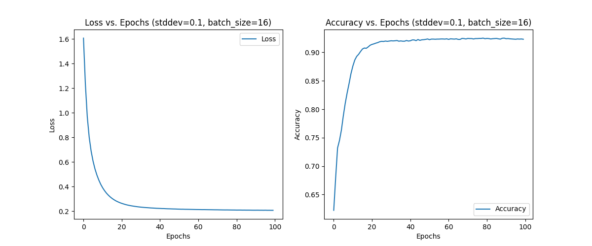
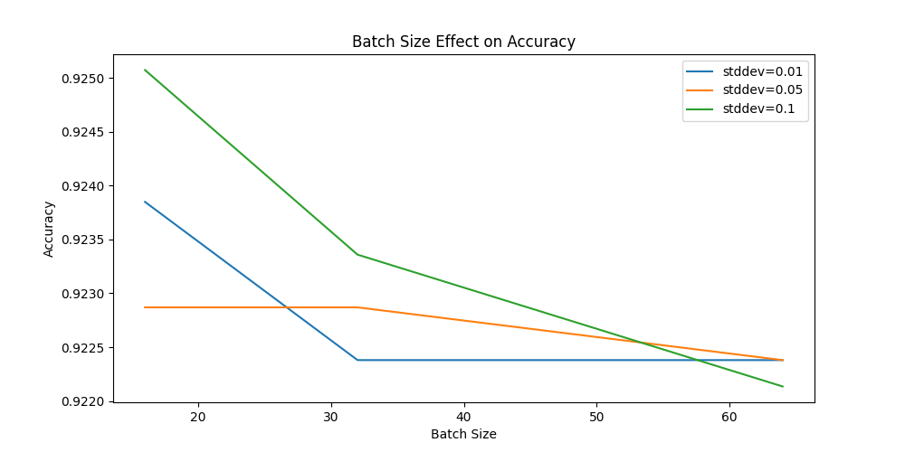
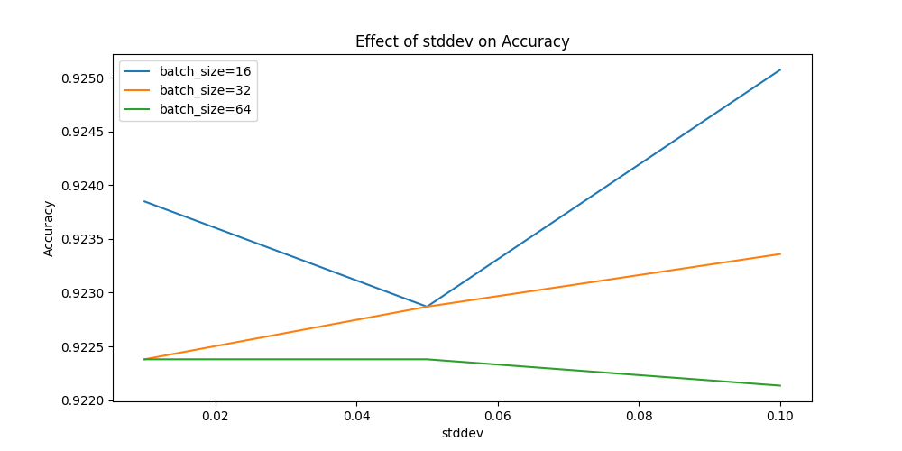

# Dry Bean Classification with Neural Networks

This repository contains a PyTorch implementation of a neural network for classifying different types of dry beans. The model is trained on the [Dry Bean Dataset](https://archive.ics.uci.edu/ml/datasets/Dry+Bean+Dataset), with experiments conducted to evaluate the effect of batch size and weight initialization standard deviation on model performance.

## Project Overview

The project involves the following steps:

1. **Data Loading and Preprocessing:**  
   The dataset is loaded, and the class labels are mapped to numerical values. The data is split into training and testing sets, and features are normalized using `StandardScaler`.

2. **Model Definition:**  
   A simple feedforward neural network is defined using PyTorch with one hidden layer. The network includes configurable weight initialization using different standard deviations.

3. **Training and Validation:**  
   The model is trained for 100 epochs with varying batch sizes and standard deviations for weight initialization. The training process is logged, and the model's accuracy and loss are monitored.

4. **Experimentation:**  
   The script runs experiments across multiple batch sizes and standard deviations. Results are visualized using matplotlib.

5. **Saving the Best Model:**  
   The best-performing model is saved for future use.

## How to Run

### Prerequisites

Ensure you have Python installed. You can check your Python version by running:

```bash
python --version
```

### Install Dependencies

The project requires several Python packages. You can install these dependencies using the `requirements.txt` file provided in the repository.

1. Clone the repository:

    ```bash
    git clone <repository_url>
    cd <repository_directory>
    ```

2. Install the required packages using `requirements.txt`:

    ```bash
    pip install -r requirements.txt
    ```

   This command will install all necessary libraries, including `torch`, `scikit-learn`, `pandas`, and `matplotlib`.

### Dataset

Place the `Dry_Bean_Dataset.csv` file in the root directory of the project. You can download the dataset from [here](https://archive.ics.uci.edu/ml/datasets/Dry+Bean+Dataset).

### Running the Code

After installing the dependencies and placing the dataset file, run the script:

```bash
python main.py
```

This will execute the code, which will:
- Load and preprocess the dataset.
- Train the neural network model with different configurations.
- Plot training and validation loss and accuracy.
- Save the best-performing model weights in the `weights/` directory.

### Output and Results

After running the experiments, the following plots are generated:

1. **Loss and Accuracy vs. Epochs Plot**  
   This combined plot shows both the training loss and accuracy trends over epochs for the best model configuration.

   

2. **Batch Size Effect on Accuracy**  
   This plot demonstrates how different batch sizes affect the model’s accuracy.

   

3. **Stddev Effect on Accuracy**  
   This plot shows the impact of different standard deviations used for weight initialization on model accuracy.

   

### Customization

You can easily adjust the standard deviations, batch sizes, and other hyperparameters directly in the script by modifying the `stddev_values` and `batch_sizes` lists.

## Code Structure

- **Data Loading and Preprocessing:**  
  The dataset is loaded, and the class labels are mapped using a dictionary. Features are scaled using `StandardScaler`, and data is split into training and testing sets.

- **Model Definition:**  
  The neural network is implemented using PyTorch with a hidden layer of 16 units and ReLU activation.

- **Training and Validation:**  
  The training loop tracks accuracy and loss over 100 epochs, with the best model saved based on validation accuracy.

- **Experimentation:**  
  The script runs experiments across multiple batch sizes and weight initialization standard deviations. Results are visualized using matplotlib.

- **Saving the Model:**  
  The best model is saved in the `weights/` directory.

## Acknowledgments

Dataset source: UCI Machine Learning Repository - [Dry Bean Dataset](https://archive.ics.uci.edu/ml/datasets/Dry+Bean+Dataset).
